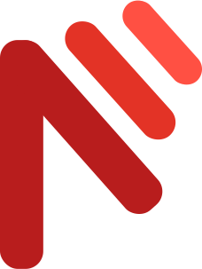

# <div style="display: flex; gap: 9px; align-items:center;"> Welcome to Netmifi - a product of the future</div>

## Overview
This project is divided into three main parts:
- **Frontend:** Built with React and TypeScript using Vite.
- **Backend:** Developed using Node.js.
- **Database:** Uses MongoDB.
  
  ## Setup and Installation
To get started with the project, follow these steps:

1. **Clone the Repository**  
   Clone the repository to your local machine:
   ```bash
   git clone https://github.com/netmifi/netmifi/

2. **Setup the Frontend**
    Navigate to the frontend folder, install dependencies, and start the development server:
    ```bash
    cd frontend
    npm install 
    npm run dev

3. **Setup the Backend**
Navigate to the backend folder, install dependencies, and start the server:
    ```bash
    cd backend
    npm install 
    npm run dev

## Architecture 

### Frontend (React + TypeScript)
The frontend is built with React and TypeScript, bundled with Vite for a fast development experience. Use the alias `@` to reference the `src` folder for cleaner imports. Key libraries and tools used include:
- **Tailwind CSS:** Utility-first CSS framework. [Tailwind CSS Website](https://tailwindcss.com/)
- **shadcn UI:** Pre-built UI components stored in the `components/ui` folder.  
  *Note:* The shadcn components are stored in the `components/ui` directory and help streamline your UI development. More details can be found in the [shadcn UI Documentation](https://ui.shadcn.com/).
- **Zod:** For schema validation. [Zod on GitHub](https://github.com/colinhacks/zod)
- **Axios:** For making HTTP requests. [Axios Documentation](https://axios-http.com/)
- **TanStack Query:** For managing server state. [TanStack Query](https://tanstack.com/query/latest)
- **Additional Tools and Libraries:**
  - **TanStack Query Devtools:** For debugging query states.
  - **Lucide React:** Icon library. [Lucide Icons](https://lucide.dev/)
  - **Font Awesome:** Icon toolkit. [Font Awesome](https://fontawesome.com/)
  - **React Hook Form:** For handling form state. [React Hook Form](https://react-hook-form.com/)

### Backend (Node.js)
The backend is built using Node.js with the following key libraries:
- **Nodemon:** Automatically restarts the server during development. [Nodemon Website](https://nodemon.io/)
- **Bcrypt:** For hashing passwords. [Bcrypt on GitHub](https://github.com/kelektiv/node.bcrypt.js/)
- **Mongoose:** For MongoDB object modeling. [Mongoose Documentation](https://mongoosejs.com/)
- **Dotenv:** For managing environment variables. [Dotenv on GitHub](https://github.com/motdotla/dotenv)
- **Helmet:** To secure HTTP headers. [Helmet Documentation](https://helmetjs.github.io/)
- **JWT (jsonwebtoken):** For token-based authentication. [jsonwebtoken on GitHub](https://github.com/auth0/node-jsonwebtoken)
- **Nodemailer:** For sending emails. [Nodemailer Documentation](https://nodemailer.com/about/)
- **Multer:** For handling file uploads. [Multer on GitHub](https://github.com/expressjs/multer)
- **Cookie-parser:** For parsing cookies. [Cookie-parser on GitHub](https://github.com/expressjs/cookie-parser)

### Database (MongoDB)
This project uses MongoDB for data storage. For installing MongoDB Compass (ideal for offline machines), please refer to this [YouTube video](https://youtu.be/gB6WLkSrtJk).

## Environment Variables
To view or request the environment variable settings, please refer to the owner of this repository.
